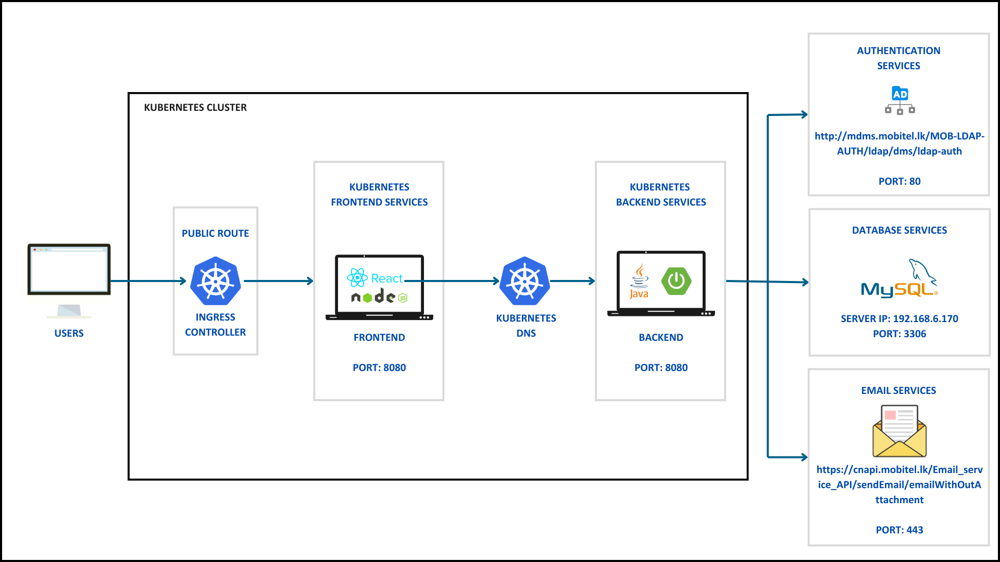
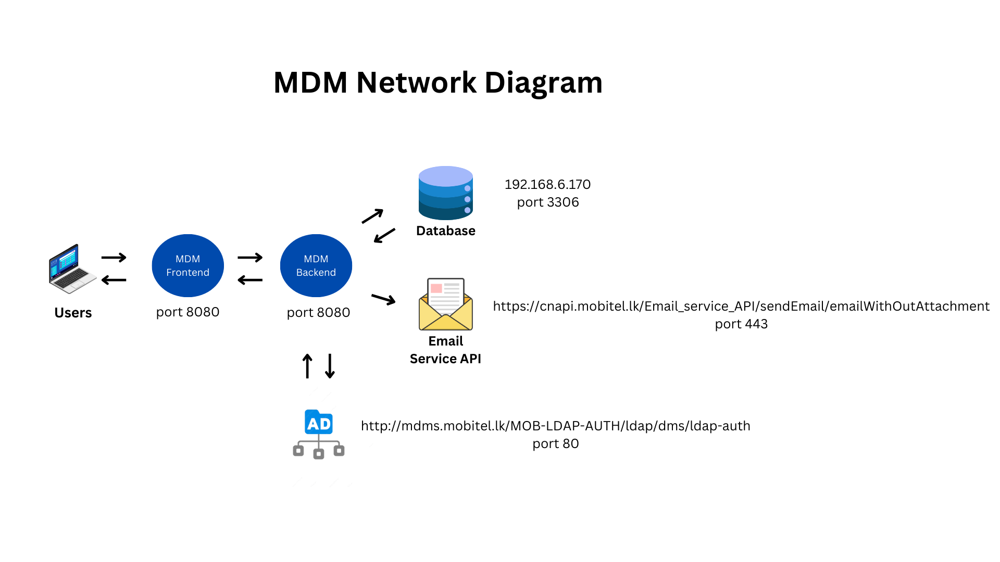

# Project: Mobitel Data Management
- Line Manager:
- Application Owner: Shaheed Musthalie
- Developer: Aththas Rizwan

## Application Overview

The Mobitel Data Management System is a comprehensive application developed using Spring Boot and ReactJS with MySQL as the database. This system is designed to enhance the operations of the Information Security Division by providing critical features such as Version Control, Access Management, Activity Monitoring, File Handling, and Email Notifications. It integrates Active Directory (AD) accounts and focuses on maintaining Purchase Order (PO) details and Annual Maintenance Contract (AMC) contract details, including notifications for contract end and acknowledgment, as well as centralized file management.

## Features
Version Control: Track and manage versions of important files and documents.
Access Management: Control and manage user access to various sections of the system.
Activity Monitoring: Monitor and log user activities for auditing and security purposes.
File Handling: Efficiently manage and organize files related to PO and AMC details.
Email Notifications: Automated notifications for contract end dates and acknowledgments.
AD Account Integration: Seamless integration with Active Directory accounts for user authentication and management.
Centralized File Management: Maintain a centralized repository for PO and AMC contract details.


## Application Architecture

The application follows a client-server architecture. Below is a brief overview of the network architecture:



## Application Architecture Summery
- **React Frontend**: A single-page application (SPA) built with React. It interacts with the backend API to fetch and display data.
- **Spring Boot API**: A RESTful API built with Spring Boot that handles HTTP requests from the frontend and performs business logic operations.

## Frontend Technology summery:

- Node.js and npm with node:18-alpine base image
- homepage :  /mobiDM/
- LB URL: https://cbpapi-stg.mobitel.lk/mobiDM
- Jenkins URL: http://172.27.44.25:8080/job/MobitelDataManagementFrontEnd/
- Health Probe URL:

### Guides
Use the following guides to understand how features work:
Feature Guides
1. Version Control
   Overview:
   Version Control tracks changes to important files and documents, allowing users to view historical versions, compare changes, and restore previous versions if necessary.

How It Works:

Viewing Versions:

Navigate to the “AMC or PO User Activity” section in the application.
Select the version you want to view from the list.
You will see a list of versions with timestamps and user information.

2. Access Management
   Overview:
   Access Management controls and manages user permissions within the system, ensuring that users have appropriate access to various sections and features.

How It Works:

Adding Users:

Go to the “Access Management/Provide Access By Manual” section.
View the list of users and their current permissions.
Use the “Add User” button to add a new user and assign permissions.

Removing Users:

Find the user you wish to remove.
Click the “Remove” button next to their email.
Confirm the action to remove the user.

Requesting Permissions:

Go to the “Access Management/Request Access” section.
View the access which the user already had.
Use the request access button to request new access from other users to view their PO and AMC details.
View the access request to view the requests which are pending

Request Managing:

Go to the “Access Management/Provide Access By Request” section.
View the requests which are sent by others.
Decide whether to provide them the access or not.

3. Activity Monitoring
   Overview:
   Activity Monitoring logs and tracks user actions within the system, providing insights into usage patterns and security events.

How It Works:

Viewing Activity Logs:

Navigate to the “AMC or PO User Activity” section in the application.
Review the list of AMC/PO related user activities, including timestamps, user actions, and affected rows.

4. File Handling
   Overview:
   File Handling allows users to manage and organize files related to PO and AMC details, including uploading, downloading files.

How It Works:

Uploading Files:

Go to the “AMC or PO” section.
Click the “Upload” button when add/update AMC/PO.
Select the files from your local system and click “Submit.”

Downloading Files:

Go to the “AMC or PO” section.
Browse the list of files and select the ones you wish to download.
Click the icon to save them to your local system.
Files are only accessible through the website only for authorized users who have the file viewing access.

5. Email Notifications
   Overview:
   Email Notifications send automated alerts and reminders for important events, such as contract end dates and acknowledgments.

How It Works:

Whenever the critical events occurred, it will automatically send the appropriate email to the relevant users.
Scheduled email using cron jobs for notify the authorities about the expiration of contracts.

6. AD Account Integration
   Overview:
   AD Account Integration allows users to authenticate using their Active Directory credentials, streamlining user management and access control.

How It Works:

Logging In:

Use your AD credentials to log in to the application.
The system will authenticate your credentials against the AD server.

### Installation

1. **Clone the repository**
   ```sh
   git clone https://Mobitel-DevOps@dev.azure.com/Mobitel-DevOps/Mobitel%20Data%20Management/_git/MobitelDataManagementFrontEnd

   ```
2. **Navigate to the path**
   ```sh
   cd MobitelDataManagementFrontEnd

   ```

3. **Install Dependenciesy**
   ```sh
   npm install

   ```
4. **Run the Development Server**
   ```sh
   npm start

   ```

